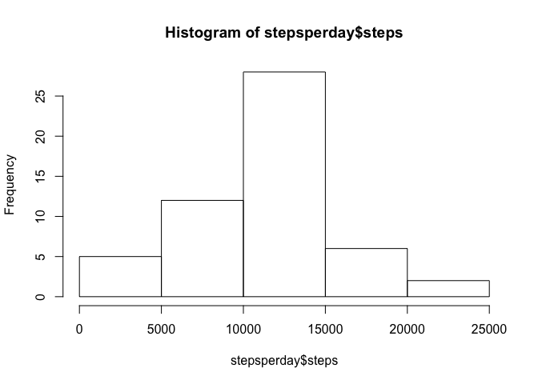
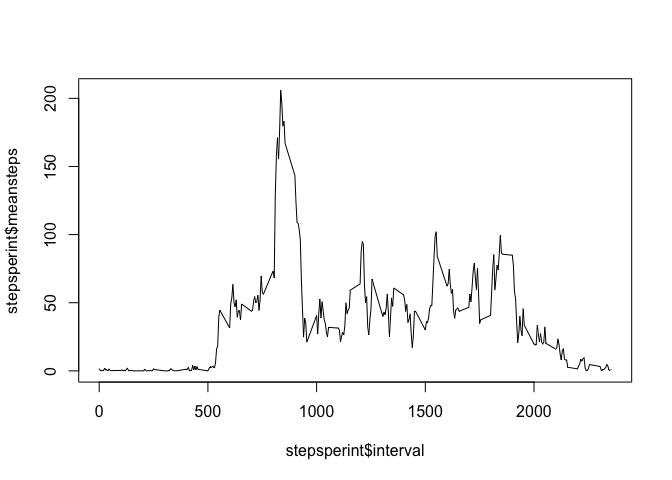
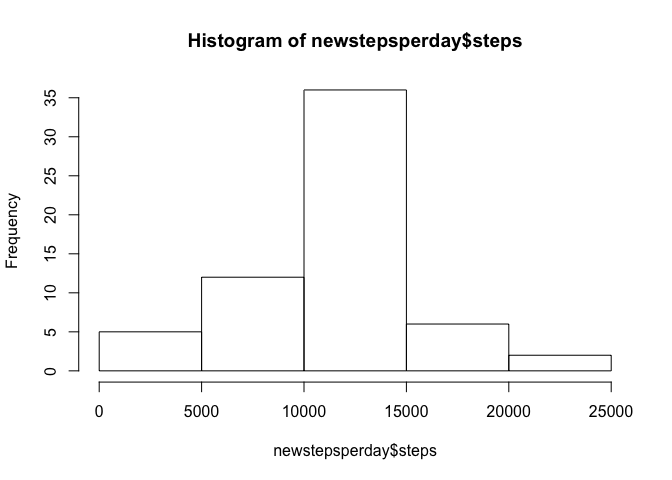
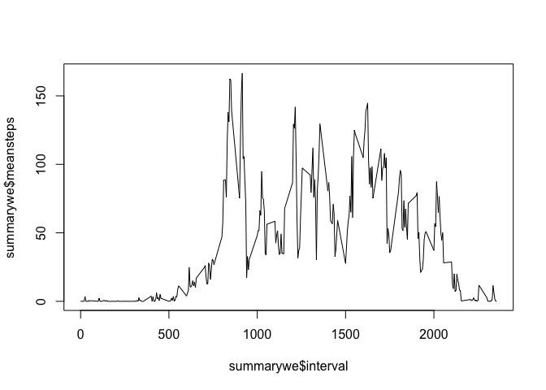
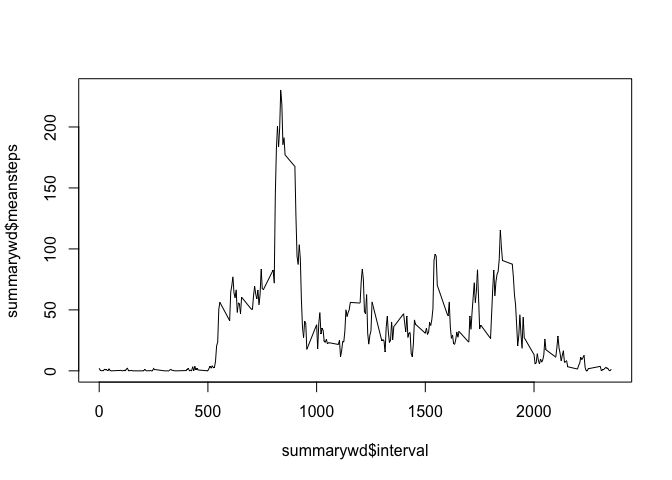

# Reproducible Research: Peer Assessment 1


## Loading and preprocessing the data

The following downloads the activity.zip file, unzips it and reads it into the R data frame called act:


```r
download.file(
  url='https://d396qusza40orc.cloudfront.net/repdata%2Fdata%2Factivity.zip',
  destfile='activity.zip',method='curl'
)

act<-read.csv(unz('activity.zip','activity.csv'))
```

## What is mean total number of steps taken per day?

We will ignore the missing values in the dataset.

Calculate the total number of steps taken per day


```r
library(dplyr)
```

```
## 
## Attaching package: 'dplyr'
## 
## The following object is masked from 'package:stats':
## 
##     filter
## 
## The following objects are masked from 'package:base':
## 
##     intersect, setdiff, setequal, union
```

```r
stepsperday<-
        summarise(
                group_by(
                        filter(act,steps!='NA'), 
                        date), 
                sum(steps)
                )
names(stepsperday)=c('date','steps')
```

A histogram of this data is shown here:


```r
hist(stepsperday$steps)
```

 

The mean and median of the total number of steps taken per day


```r
mean(stepsperday$steps)
```

```
## [1] 10766.19
```

```r
median(stepsperday$steps)
```

```
## [1] 10765
```

## What is the average daily activity pattern?

A time series plot of the 5-minute interval (x-axis) and the average number of steps taken, averaged across all days (y-axis)


```r
stepsperint<-summarise(group_by(filter(act,steps!='NA'), interval), mean(steps))
names(stepsperint)<-c('interval','meansteps')
plot.ts(x=stepsperint$interval,y=stepsperint$meansteps, type = 'l')
```

 

Which 5-minute interval, on average across all the days in the dataset, contains the maximum number of steps?


```r
max<-max(stepsperint$meansteps)

filter(stepsperint,meansteps==max)
```

```
## Source: local data frame [1 x 2]
## 
##   interval meansteps
## 1      835  206.1698
```

## Imputing missing values

Note that there are a number of days/intervals where there are missing values (coded as NA). The presence of missing days may introduce bias into some calculations or summaries of the data.

Calculate and report the total number of missing values in the dataset (i.e. the total number of rows with NAs)


```r
complete<-filter(act,!is.na(steps))
missing<-filter(act,is.na(steps))
nrow(missing)
```

```
## [1] 2304
```

Devise a strategy for filling in all of the missing values in the dataset. The strategy does not need to be sophisticated. For example, you could use the mean/median for that day, or the mean for that 5-minute interval, etc.


```r
data<-filter(act,steps!='NA')
sperint<-summarise(group_by(data, interval), mean(steps))
names(sperint)<-c('interval','steps')
sperint$steps<-as.integer(sperint$steps)
missing<-select(missing,date,interval)
mergdata<-merge(missing,sperint,by='interval')
str(mergdata)
```

```
## 'data.frame':	2304 obs. of  3 variables:
##  $ interval: int  0 0 0 0 0 0 0 0 5 5 ...
##  $ date    : Factor w/ 61 levels "2012-10-01","2012-10-02",..: 1 61 35 40 45 41 8 32 40 1 ...
##  $ steps   : int  1 1 1 1 1 1 1 1 0 0 ...
```

```r
newdata<-select(mergdata,steps,date,interval)
```


Create a new dataset that is equal to the original dataset but with the missing data filled in.


```r
cleaned<-rbind(complete,newdata)
```

Make a histogram of the total number of steps taken each day and Calculate and report the mean and median total number of steps taken per day. Do these values differ from the estimates from the first part of the assignment? What is the impact of imputing missing data on the estimates of the total daily number of steps?

Calculate the total number of steps taken per day


```r
newstepsperday<-
        summarise(
                group_by(
                        filter(cleaned,steps!='NA'), 
                        date), 
                sum(steps)
                )
names(newstepsperday)=c('date','steps')
```

A histogram of this data is shown here:


```r
hist(newstepsperday$steps)
```

 

The mean and median of the total number of steps taken per day


```r
mean(newstepsperday$steps)
```

```
## [1] 10749.77
```

```r
median(newstepsperday$steps)
```

```
## [1] 10641
```


## Are there differences in activity patterns between weekdays and weekends?

Create a new factor variable in the dataset with two levels – “weekday” and “weekend” indicating whether a given date is a weekday or weekend day.


```r
cleaned$wewd<-'weekday'
cleaned[weekdays(as.Date(cleaned$date))=='Saturday',4]<-'weekend'
cleaned[weekdays(as.Date(cleaned$date))=='Sunday',4]<-'weekend'
cleaned$wewd<-factor(cleaned$wewd)
```

Make a panel plot containing a time series plot (i.e. type = "l") of the 5-minute interval (x-axis) and the average number of steps taken, averaged across all weekday days or weekend days (y-axis). 


```r
summarywd<-summarise(group_by(filter(cleaned,wewd=='weekday'), interval), mean(steps))
summarywe<-summarise(group_by(filter(cleaned,wewd=='weekend'), interval), mean(steps))
names(summarywe)<-c('interval','meansteps')
names(summarywd)<-c('interval','meansteps')
plot.ts(x=summarywe$interval,y=summarywe$meansteps, type = 'l')
```

 

```r
plot.ts(x=summarywd$interval,y=summarywd$meansteps, type = 'l')
```

 
